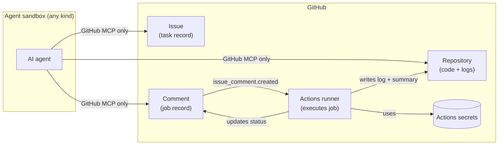

# GitHub-Native Agent Job Protocol — POC

A portable, restart-safe protocol that lets any AI agent — running in
any sandbox — submit batch jobs to GitHub Actions runners and receive
structured results, using only the GitHub MCP server as transport.

This repository is the **proof-of-concept implementation** of the
protocol described in `SPEC.md`, plus a multi-agent test harness that
executed scenarios live against this very repo.

> **New here?** The next agent picking up this work should start at
> [`HANDOFF.md`](./HANDOFF.md). It's the index of where things stand,
> what's working, what's known-broken, and the recommended priority
> order for finishing the implementation.
>
> Repo-level conventions are in [`AGENTS.md`](./AGENTS.md). Read those
> before posting a comment, creating a branch, or wiring up a workflow.

## The problem

AI coding agents are deployed in wildly varied execution environments.
Some run on a developer laptop with full shell access, some in
ephemeral cloud containers, some in tightly-restricted browser
sandboxes. Two consequences fall out of that variety:

1. **Inconsistent execution capability.** An agent that can run
   `pytest` locally on one machine cannot run it at all in a sandbox
   that bans network access or only exposes a fixed tool surface.
2. **No uniform secrets mechanism.** Agents should not hold deploy
   keys, registry tokens, or cloud credentials — the security model of
   most harnesses prohibits it.

Every harness ends up reinventing its own runner integration, secrets
story, and log retrieval flow.

## The approach

Use **GitHub Actions runners as the universal sandbox**, with **GitHub
Issues and Comments as the durable control plane**. The agent never
executes privileged work directly; it asks the runner to. The agent
never holds secrets; the runner does. The agent's only required
capability is a connection to a [GitHub MCP server](https://github.com/github/github-mcp-server).

The full spec is in [`SPEC.md`](./SPEC.md), with **real-world
correction** annotations marking everywhere live execution exposed a
design flaw that had to be patched.

## What's actually in this repo

```
SPEC.md                    — the protocol specification (with live-correction annotations)
ITERATION_REPORT.md        — multi-phase narrative of the build (see below)
HANDOFF.md                 — entry point for the next agent picking this up
AGENTS.md                  — repo conventions (branch naming, MCP quirks, etc.)
README.md                  — this file

.agent/                    — workflow scripts (live), schemas, central config
  config.json              — protocol_version, labels, timeouts, log branch (agent_login is sourced at runtime — see SPEC §3.1)
  schemas/                 — issue body, comment envelope, log manifest, per-command (Draft 2020-12)
  scripts/
    common.py              — GitHubClient Protocol + InMemoryGitHubClient + LogWriter + helpers
    rest_client.py         — live RestGitHubClient (for the workflow runner)
    handler.py             — batch-job-handler entry; live __main__ wired to REST
    lock_and_sweep.py      — lock-and-sweep entry; live __main__
    close_on_merge.py      — close-on-merge entry; live __main__ + branch sweep
    agent_lib/             — pure-python helpers for agent-mode (envelope/meta/poll/CLI)
  commands/                — registered commands: echo, build, run-tests, bad-summary, chatty
  scripts/requirements.txt — jsonschema, pyyaml, requests

.github/workflows/
  lock-and-sweep.yml       — issues.opened → label + sweep (live)
  batch-job-handler.yml    — issue_comment.created → run command (live; instrumented with markers)
  close-on-merge.yml       — pull_request.closed → close + lock + delete branches (live)

skills/                    — agent-side skill packages (spec stage)
  batch-job/               — submit one job, await result (SKILL.md + Python helpers)
  task-dag/                — claim issue, plan subagents, merge, schedule successors

harness/                   — live execution harness against real GitHub
  README.md                — harness conventions
  RUNS.md                  — forensic ledger of all live scenario runs
  scenarios/01_*.md … 15_*.md  — 15 scenario specs (9 driven live, 6 spec-only)
  lib/                     — naming + asserts helpers
  runs/                    — per-run touchstone files

tests/                     — 386 tests, ≥95% coverage on .agent/ + skills/
  unit/
  e2e/
  conftest.py
  requirements.txt

retrospective/             — skill specs harvested from this session (PR #50)
  README.md                — index of 9 skill specs + AGENTS.md template spec
  <skill>/README.md        — human motivation per skill
  <skill>/SPEC.md          — implementation-grade detail
  <skill>/excerpts.jsonl   — session evidence (where useful)
  agents-md-template/      — spec for AGENTS.md additions
```

## Status

**End of session 1**: spec validated end-to-end against real GitHub.

| | |
|---|---|
| Unit tests | 386 passing, ~95% coverage |
| Live scenarios driven | 9 of 15 (issue numbers in `harness/RUNS.md`) |
| Real-world bugs discovered + fixed | 7 |
| Spec amendments | 3 (lock placement, branch separator, comment-trailer tolerance) |
| PRs opened in this session | 50 |
| Branches at end | 3 (main, `_agent_runs`, dispatcher's working branch) |

The repository contains real, inspectable artifacts from each live
scenario run. Click through `harness/RUNS.md` to see the issues,
comments, branches, and `_agent_runs` log chunks that the protocol
produced under live execution.

## Read order for newcomers

1. **[`HANDOFF.md`](./HANDOFF.md)** — what's done, what's next.
2. **[`AGENTS.md`](./AGENTS.md)** — conventions you must follow.
3. **[`ITERATION_REPORT.md`](./ITERATION_REPORT.md)** — full narrative
   of how the implementation evolved across 4 phases.
4. **[`SPEC.md`](./SPEC.md)** — the protocol design.
5. **[`harness/RUNS.md`](./harness/RUNS.md)** — what's been tested
   live (and what hasn't).
6. **[`retrospective/README.md`](./retrospective/README.md)** —
   reusable skill specs harvested from session 1.

## Quick architecture



The agent submits work by posting a structured comment on a labelled
issue. A workflow on the default branch picks it up, runs the job in
a runner that has access to whatever secrets are configured at the
repo level, writes logs and a summary back to the repo, and updates
the comment's status fields. The agent polls the comment until
terminal status, reads the summary, optionally acks the result.

(Note: the spec originally required the issue to be **locked** for
the workflow to fire. Live execution discovered that locked issues
refuse comments from `GITHUB_TOKEN`, blocking the workflow's
write-back. The lock has been moved to issue close — see SPEC §3
"Real-world correction" and `ITERATION_REPORT.md` Phase 4 bug #6.)

## Properties

- **Transport-agnostic.** Any agent harness with GitHub MCP access can
  drive the protocol.
- **Secrets stay in GitHub.** Workflow secrets are configured once at
  the repo or org level. Agents never see them.
- **Restart-safe.** All state lives in issue and comment bodies.
- **Audit-complete.** Every job has a pinned commit SHA, a full
  structured log on a dedicated orphan branch, and a typed summary.
- **Concurrency-friendly.** Multiple subagents can run in parallel
  under one primary, each on their own branch.
- **Public-repo safe.** Label + author filters make the protocol
  resistant to drive-by manipulation by anonymous users.

## What this enables

Anything a GitHub Actions runner can do, the agent can request:

- Build, lint, type-check, run tests against staging
- Container builds and registry pushes
- Cloud deploys (any provider with an Actions integration)
- Infrastructure changes (Terraform apply, Pulumi, etc.)
- Cross-repo orchestration
- Long-running jobs up to the runner's max duration

The same protocol that an agent uses to "run tests" can be used to
"deploy to staging" without any new agent capability. The set of
available commands is governed by what the workflow's command registry
exposes — extensible per-repo by adding a schema + a handler module.

## License

TBD.
