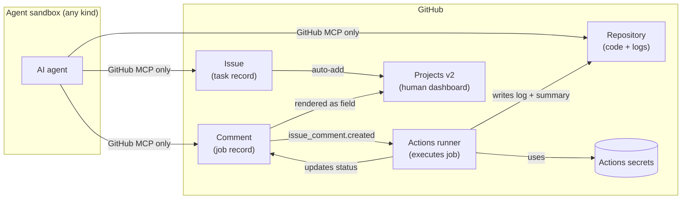
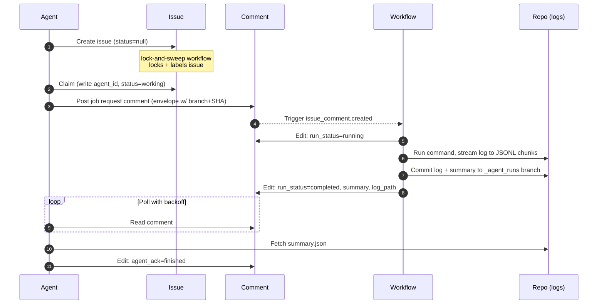
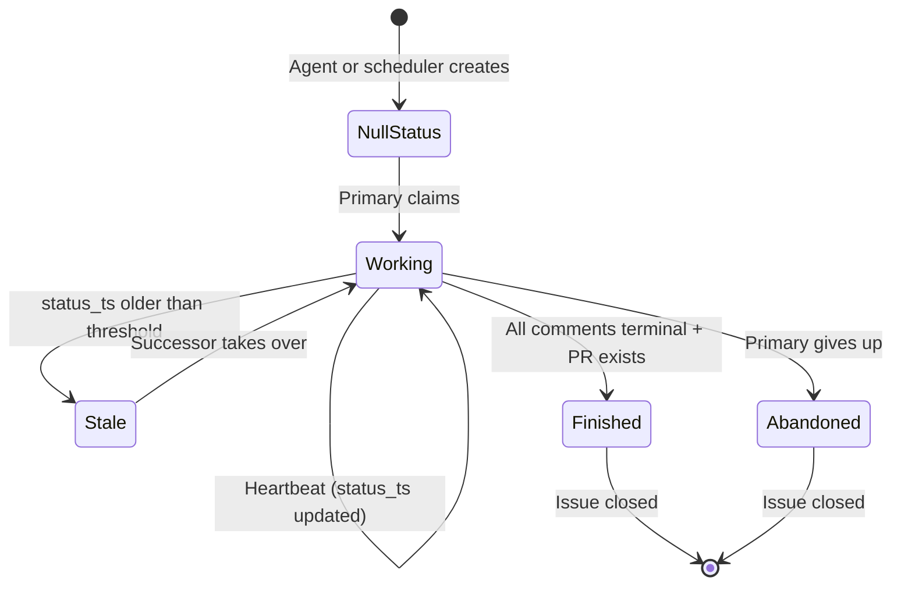
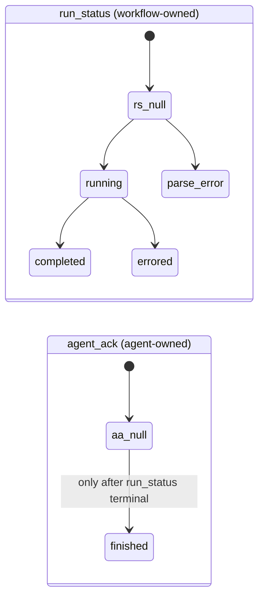

# GitHub-Native Agent Job Protocol

A portable, restart-safe protocol that lets any AI agent — running in any sandbox — submit batch jobs to GitHub Actions runners and receive structured results, using only the GitHub MCP server as transport.

## The problem

AI coding agents are deployed in wildly varied execution environments. Some run on a developer laptop with full shell access, some in ephemeral cloud containers, some in tightly-restricted browser sandboxes. Two consequences fall out of that variety:

1. **Inconsistent execution capability.** An agent that can run `pytest` locally on one machine cannot run it at all in a sandbox that bans network access or only exposes a fixed tool surface. Build, test, deploy, and infrastructure tasks each require their own runtime context, and most agent harnesses provide none of them uniformly.
2. **No uniform secrets mechanism.** Agents generally should not hold deploy keys, registry tokens, or cloud credentials — the security model of most harnesses prohibits it. But work that needs those secrets (running integration tests against staging, publishing a package, applying a Terraform plan) still has to happen somewhere.

The result is that every agent harness ends up reinventing its own runner integration, its own secrets story, and its own log retrieval flow. The agent's portability suffers, and the security boundary blurs.

## The approach

Use **GitHub Actions runners as the universal sandbox**, with **GitHub Issues and Comments as the durable control plane**. The agent never executes privileged work directly; it asks the runner to. The agent never holds secrets; the runner does.

The agent's only required capability is a connection to a [GitHub MCP server](https://github.com/github/github-mcp-server). Everything else — execution, secrets, logging, audit, restart recovery — is handled by GitHub primitives.

The agent submits work by posting a structured comment on a locked issue. A workflow on the default branch picks it up, runs the job in a runner that has access to whatever secrets are configured at the repo level, writes logs and a summary back to the repo, and updates the comment's status fields. The agent polls the comment until terminal status, reads the summary, acks the result.

## Properties

- **Transport-agnostic.** Any agent harness with GitHub MCP access can drive the protocol. Tested for compatibility in mind with multiple agent CLIs (e.g. agents that expose only a GitHub MCP tool surface).
- **Secrets stay in GitHub.** Workflow secrets are configured once at the repo or org level. Agents never see them and cannot exfiltrate them. The agent's threat surface is what it can ask the workflow to do, not what credentials it possesses.
- **Restart-safe.** All state lives in issue and comment bodies. An agent that crashes mid-task can be replaced; the successor reads issue state and resumes.
- **Audit-complete.** Every job has a pinned commit SHA, a full structured log committed to the repository, and a typed summary. Issue/comment history is immutable on GitHub's side.
- **Concurrency-friendly.** Multiple subagents can run in parallel under one primary, each on their own branch, each with their own job comments.
- **Public-repo safe.** Locked issues plus author/label filters make the protocol resistant to drive-by manipulation by anonymous users.

## What this enables

Anything a GitHub Actions runner can do, the agent can request:

- Build, lint, type-check, run tests against staging
- Container builds and registry pushes
- Cloud deploys (any provider with an Actions integration)
- Infrastructure changes (Terraform apply, Pulumi, etc.)
- Cross-repo orchestration (one repo's workflow opens issues in another)
- Long-running jobs (data backfills, training runs) up to the runner's max duration
- Anything else expressible as a workflow command

The same protocol that an agent uses to "run tests" can be used to "deploy to staging" without any new agent capability. The set of available commands is governed by what the workflow's command registry exposes — extensible per-repo.

## How a job runs (sequence)

## Issue lifecycle

## Comment lifecycle

Two independent fields prevent races between the workflow and the agent.

The workflow only writes the comment while `run_status` is non-terminal. The agent only writes after `run_status` is terminal. There is no concurrent-writer window.

## Repository contents

- `README.md` — this file
- `SPEC.md` — the full protocol specification, including schemas, workflows, branch model, and skill descriptions
- `.agent/` — workflow scripts, JSON schemas, and central configuration (per spec)
- `.github/workflows/` — `lock-and-sweep.yml`, `batch-job-handler.yml`, `close-on-merge.yml` (per spec)
- `skills/` — agent-side skill packages: `batch-job` (submit one job, await result) and `task-dag` (claim issue, plan subagents, dispatch jobs, open PR, schedule successors)

The skills are written generically and are intended to work with any agent harness that exposes the GitHub MCP server, including but not limited to Claude Code, Codex, and other CLIs.

## Status

Specification phase. See `SPEC.md` for the complete design. Implementation (workflows, scripts, skill packages) is the next milestone.

## License

TBD.
